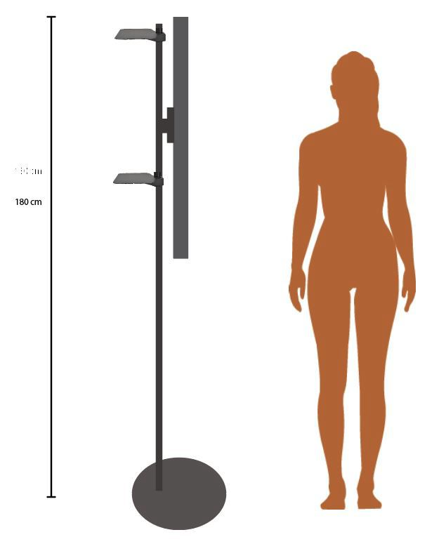

I would like to share some experiences and insights about a product that my colleagues and I have developed for one of our customers. In this project we drew on a range of established and exponential technologies to deliver a state of the art solution.

### Business requirement

The availability of personal assistance in retail stores is rapidly decreasing due to strong competition, especially from on-line stores, which is driving reductions in staff. At the same time, the increased pace of changing product assortments and placement makes it difficult for staff to stay updated. The objective of this project was to combine the ease of use of speech based, natural language interaction with a life-like avatar with the business knowledge about stock level and location, consumer trends, seasonal and holiday variations, etc. to provide the most personable and qualified customer experience.

### Solution description

Our solution consists of multiple components, which are orchestrated by a custom middleware. We have taken a mix-and-match approach and utilised readily available services from multiple vendors in order to build a functioning solution.

#### Front-end

The visible front-end consists of a life-like digital avatar (from Quantum Capture's <em>CTRL Human</em> platform) which is displayed on a large monitor in a retail setting. The monitor is positioned such that the avatar is roughly life-size and at eye level with the customers. Customers can interact with the avatar either by speaking to it or by pressing on-screen buttons on the touch display.

Most digital avatar products rely on a push to talk paradigm, where the user must hold down a button while speaking to the avatar. Our testing quickly revealed that this was a major barrier to a good user experience in our scenario, partly because this forces the user to stand uncomfortably close to the large monitor, and partly because user expectations have progressed beyond the point where push to talk seems intuitive. We have therefore developed a custom component, which combines the input from the microphone with the input from a camera to automatically detect when a user is speaking to the avatar. This makes the customer's interaction with the avatar much more natural and intuitive.

#### Back-end

On the back-end, our solution utilizes different cloud services to provide the necessary functionality and information.

A number of different cloud services, many of which are native to <em>CTRL Human</em>, can convert the user’s speech to text. We currently support IBM Watson Speech to Text, Amazon Web Services' Transcribe, and Google Cloud Text to Speech. They all provide good speech recognition when coupled with a high quality microphone and software techniques to avoid background noise from the environment. Other providers offer similar services with similar levels of performance. The primary differences between services seem to be the number of supported languages and the degree of customisation offered.

The heart of the back-end is Natural Language Processing (NLP), which interprets the user's input and returns intents that guide the conversation. Our solution uses SAP Conversational AI (CAI) but also supports other NLP services. In order to provide detailed information about products, availability, location, etc. we augment the output from the NLP, when appropriate, with data from the SAP ERP system in our custom middleware. In order to offload this processing from the SAP ERP system, and because it provides additional functionality such as easy on-screen filtering and search refinement for the user, we use a Qlik application as the intermediary for the data from the ERP.

Finally, a text to speech service is used to render the conversational responses from the NLP to the user. Amazon, IBM, Google, and others offer good text to speech services with differing options and degrees of customisation.

### Future improvements

One of the main goals of the project was to try to make the interaction between the user and the avatar as simple, intuitive, and ultimately natural as possible. Although our product does this fairly well, we have identified a number of areas that need improvement. Here are some examples.

The NLP can be further refined in order to improve the quality of responses as well as the breadth of possible interactions. However, with the current technology, a balance must be struck between the two. If one attempts to make the scope of the NLP very broad, this can come at the cost of accuracy in the provided responses when topic areas begin to overlap. Although this technology has come a long way in recent years, creating a good conversational AI is still as much art as science and requires continuous refinement.

Another obstacle to providing a completely natural conversational interaction is the lag between the user's input and the avatar's response. In our system, this lag is the sum of the lags due to 1) speech to text, 2) NLP, 3) ERP data processing, 4) text to speech, and 5) the network latency involved in each of these. Some of these will be reduced over time by general improvements in network and service performance, and some we can improve in our solution architecture through service locality. Nevertheless, short of being able to deploy all components locally on a single device within the retail setting, there will likely always be some lag in this kind of system.

<em>This post was first published on the [SAP Community Blog](https://blogs.sap.com/2019/02/27/frontlineai-better-customer-service-experiences-through-digital-humans/).</em>

